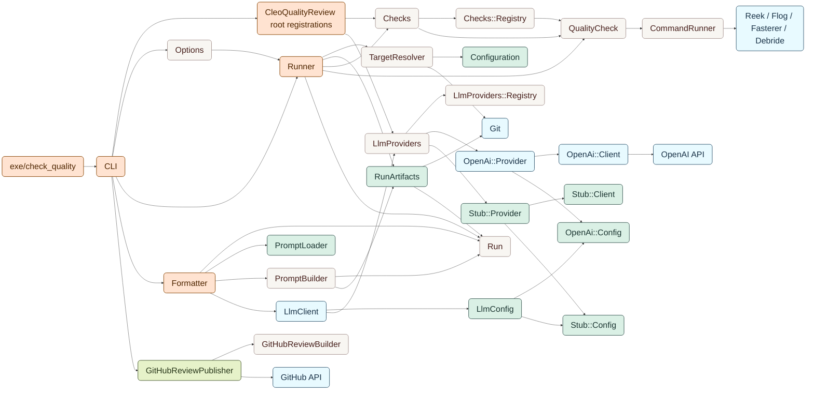

# Cleo Quality Review

[](https://github.com/meetcleo/cleo-quality-review/actions/workflows/tests.yml)

Runs a suite of code quality tools against your code changes, and feeds them to an LLM to help make the feedback easier to apply.

## Use cases

### Review my own code locally before pushing

This will run all of the tools locally, and report back a human-readable report on what needs changed and why.

```
bundle exec quality_review foo.rb
```

### 🤖 Agents review their own code before pushing

This will run all of the tools locally, and report back an agent-readable report on what needs changed and why.

```
bundle exec quality_review foo.rb --format=agent
```

### 🤖 Github actions reviews changes on PR

This will run all of the tools on a PR branch, and report back a github-readable report on what needs changed and why. This will add [annotation comments](https://docs.github.com/en/actions/reference/workflows-and-actions/workflow-commands#setting-a-debug-message) to your code where issues are reported.

```
bundle exec quality_review foo.rb --format=github
```


## Installation

```
bundle add cleo_quality_review --group=development
```

In your local environment, configure the ENV variable named `CLEO_QUALITY_REVIEW_OPEN_AI_KEY` with your own [OpenAI API key](https://platform.openai.com/api-keys).


## Usage 

```bash
bundle exec check_quality --format agent --checks reek --files vendor/cleo_quality_review/lib
bundle exec check_quality --format github --checks fasterer --files app/services/my_area
bundle exec check_quality --checks debride --files app/models/example.rb
CLEO_QUALITY_REVIEW_OPEN_AI_KEY=sk-... bundle exec check_quality --format human --files app/models/example.rb
```

`--files` accepts files or directories. Directories are expanded recursively, then filtered by the active config. When `--files` is omitted, `check_quality` targets changed files from `origin/main...HEAD` that match the active config.

CI can split analysis from output rendering so the Ruby quality tools run once and multiple outputs reuse the same artifacts:

```bash
review_id="$(bundle exec check_quality analyze --checks all --changed)"
bundle exec check_quality render --format github --review-id "${review_id}"
bundle exec check_quality render --format pr_review --review-id "${review_id}" > "tmp/quality_checks/${review_id}/pr_review.json"
GITHUB_TOKEN=... bundle exec check_quality publish-pr-review --review-id "${review_id}"
```

`analyze` prints the deterministic review ID for the captured diff. The artifact directory is `tmp/quality_checks/<review_id>/`, and later commands reuse it when `complete.json` is present.

## Checks

The gem embeds Ruby check adapters for Reek, Flog, Fasterer, and Debride. Each run writes raw tool artifacts to `tmp/quality_checks/<review_id>/<tool_type>/<check>/raw_output.*` and also normalizes findings for machine-readable output.

Debride reports methods that static analysis thinks may be unused. It runs with Rails-aware analysis by default, and its findings should be treated as candidates for investigation rather than automatic deletion.

`agent` output uses the agent prompt to condense run metadata, the git diff, raw tool outputs, and normalized findings into JSON for coding agents.

`github` output uses the GitHub prompt to condense the full report into GitHub workflow annotations for the most relevant findings.

`pr_review` output uses the PR review prompt to condense the full report into JSON for GitHub pull request reviews.

`publish-pr-review` posts that rendered PR review JSON. Comments that map to commentable right-side diff lines become inline review comments; comments that do not map cleanly are omitted.

## Prompts

Prompts are format-specific:

- `human`
- `agent`
- `github`
- `pr_review`

Local overrides are loaded first from `.cleo_quality_review/prompts/<format>.md`, then `.cleo_quality_review/<format>.md`. For backwards compatibility, `human` also supports `.cleo_quality_review/prompt.md`. If no local prompt exists, the gem uses `vendor/cleo_quality_review/prompts/<format>.md`.

## File Configuration

Target files are configured with YAML. The gem always loads its default config, then optionally loads `.cleo_quality_review.yaml` from the repository root.

```yaml
inherit_from:
  - ~/.config/cleo_quality_review.yml

AllTools:
  Include:
    - "**/*.rb"
    - "**/*.rake"
  Exclude:
    - "vendor/**/*"
    - "db/schema.rb"
```

`inherit_from` accepts a string or list of config files. Relative paths are resolved from the config file that declares them, and `~` can be used for user-level preferences. The special values `default` and `gem:default` point at the gem's bundled default config.


## LLM Configuration

All output formats use OpenAI's Responses API.

| Variable | Required | Description |
|----------|----------|-------------|
| `CLEO_QUALITY_REVIEW_OPEN_AI_KEY` | Yes | OpenAI API key |
| `CLEO_QUALITY_REVIEW_TIMEOUT_SECONDS` | No | OpenAI request timeout in seconds (default: 180) |

The model is currently fixed to `gpt-5.5`.

## Architecture

`check_quality` is a thin executable over the `CleoQualityReview` library. A run resolves the target files, executes the selected Ruby quality tools, stores raw artifacts, normalizes findings, and then renders one of the supported output formats.



All formats build a prompt from the run data and artifacts, then send it through the configured LLM provider. The selected format determines which prompt is loaded and therefore the output shape. The `publish-pr-review` subcommand uses `GitHubReviewPublisher` to post rendered reviews directly to GitHub pull requests.
