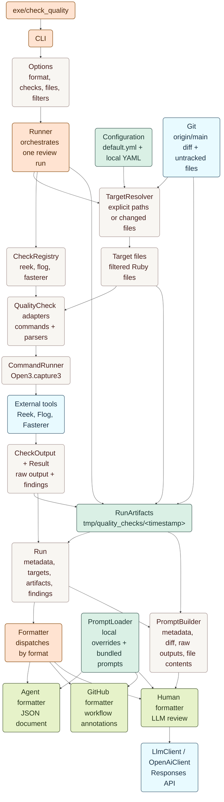

# Cleo Quality Review

Local quality checks for Cleo repositories.

## Architecture

`check_quality` is a thin executable over the `CleoQualityReview` library. A run resolves the target files, executes the selected Ruby quality tools, stores raw artifacts, normalizes findings, and then renders one of the supported output formats.



The non-human formats are deterministic: `agent` serializes the `Run` plus prompt instructions as JSON, and `github` turns normalized findings into GitHub Actions annotations. The `human` formatter builds a prompt from the same run data and artifacts, then sends it through the configured LLM provider.

## Usage

```bash
bundle exec check_quality --format agent --checks reek --files vendor/cleo_quality_review/lib
bundle exec check_quality --format github --checks fasterer --files app/services/my_area
OPEN_AI_API_KEY=... bundle exec check_quality --format human --files app/models/example.rb
```

`--files` accepts files or directories. Directories are expanded recursively, then filtered by the active config. When `--files` is omitted, `check_quality` targets changed files from `origin/main...HEAD` that match the active config.

## Checks

The gem embeds Ruby check adapters for Reek, Flog, and Fasterer. Each run writes raw tool artifacts to `tmp/quality_checks/<epoch>/<check>/raw_output.*` and also normalizes findings for machine-readable output.

`agent` output prints one JSON document containing run metadata, the git diff, all raw tool outputs, format instructions, and normalized findings.

`github` output prints GitHub workflow annotation commands for normalized findings, followed by a notice summarizing the top actionable issues when findings are present. Configure the summary count with `CLEO_QUALITY_REVIEW_GITHUB_SUMMARY_LIMIT`.

## Prompts

Prompts are format-specific:

- `human`
- `agent`
- `github`

Local overrides are loaded first from `.cleo_quality_review/prompts/<format>.md`, then `.cleo_quality_review/<format>.md`. For backwards compatibility, `human` also supports `.cleo_quality_review/prompt.md`. If no local prompt exists, the gem uses `vendor/cleo_quality_review/prompts/<format>.md`.

## File Configuration

Target files are configured with YAML. The gem always loads its default config, then optionally loads `.cleo_quality_review.yaml` from the repository root.

```yaml
inherit_from:
  - ~/.config/cleo_quality_review.yml

AllTools:
  Include:
    - "**/*.rb"
    - "**/*.rake"
  Exclude:
    - "vendor/**/*"
    - "db/schema.rb"
```

`inherit_from` accepts a string or list of config files. Relative paths are resolved from the config file that declares them, and `~` can be used for user-level preferences. The special values `default` and `gem:default` point at the gem's bundled default config.

## LLM Configuration

Human output uses OpenAI's Responses API. Set `OPEN_AI_API_KEY` to enable.

Override the API key env var name with `CLEO_QUALITY_REVIEW_OPENAI_API_KEY_ENV`.
Override the model with `CLEO_QUALITY_REVIEW_OPENAI_MODEL` (default: `gpt-5.5`).
